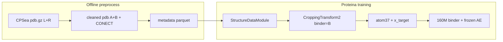

# CPSea × Proteina-Complexa — Project Context

This document captures the purpose of this work, what was implemented, where data lives, and how to run preprocessing and training. It is meant as a handoff / session anchor for continuing CPSea integration.

---

## Purpose

**Proteina-Complexa** is a flow-matching protein design stack (binder training, generation, evaluation). This project adapts **[CPSea](https://github.com/YZY010418/CPSea)** — a large cyclic peptide–receptor complex dataset — into Proteina’s existing **binder training pipeline** (`StructureDataModule` + `CroppingTransform2` + local-latent flow model).

**Goal:** Train (or finetune) a binder model on CPSea cyclic peptides (5–16 aa) against receptor fragments, using the same architecture and transforms as TED-dimer binder training, with correct chain roles (peptide = binder, receptor = target).

**Parallel ablation:** finetune flow from `complexa.ckpt` vs random-init flow (`pretrain_ckpt_path: null`), with **frozen** `complexa_ae.ckpt` in both cases.

**Target corpus (first integration):** **CPSea_PDB** (~12,419 experimental PDB-derived complexes). Larger AFDB subsets (CPCore, full CPSea) can use the same pipeline later.

---

## CPSea data conventions

| CPSea raw | Role | After preprocessing |
|-----------|------|---------------------|
| Chain **R** | Receptor / target | Chain **A** |
| Chain **L** | Cyclic peptide binder | Chain **B** |

- Peptide length in CPSea_PDB: **5–16** residues (dataset curation rule).
- Many structures have **ACE/NME** caps on L (stripped during preprocessing).
- **CONECT** records encode cyclization bonds; they are **preserved in cleaned PDBs** (remapped atom serials) but **ignored by Proteina loaders** (bonds not used in atom37 training).

---

## What we built

### 1. Preprocessor — `script_utils/preprocess_cpsea.py`

Offline adapter from CPSea `.pdb.gz` → Proteina training format.

**Per structure:**
- Rename R→A, L→B; strip H and ACE/NME caps
- Remap cyclization CONECT to surviving heavy atoms
- Verify coordinates unchanged for kept atoms (reject if drift > 1e-3 Å)
- Write cleaned PDB + audit row

**Outputs** (under `--out-dir`, default `$CPSEA_DATA_PATH/preprocessed`):

```
preprocessed/
  processed/{train,val,test}/*.pdb
  metadata/cpsea_{train,val,test}.parquet
  manifest/
    run_config.json          # reproducibility (seed, paths, config_hash)
    transformation_policy.json
    preprocess_stats.json
    per_structure_audit.csv
    rejected.csv
    output_verify.csv
```

**Splits:** By Foldseek **cluster** (`CPSea_PDB_Cluster.tsv`), 90/5/5 train/val/test, `--seed 42`.

**Scratch preprocess (done):** train **11,048** / val **726** / test **645** structures under `$CPSEA_DATA_PATH/preprocessed/`.

**Tar extract note:** `CPSea_PDB_pdb.tar.00` unpacks into a nested `CPSea_PDB_pdb/CPSea_PDB_pdb/` folder — flatten to `$CPSEA_DATA_PATH/CPSea_PDB_pdb/*.pdb.gz` before preprocessing. Preprocessor reads `.pdb.gz` directly (no manual gunzip).

### 2. Dataset config — `configs/dataset/unified/cpsea_peptide.yaml`

Wires `StructureDataModule` to preprocessed parquet + CPSea-specific transforms:
- `binder_min_length` / `binder_max_length`: 5–16
- `crop_size`: 256
- `binder_chain_id` from parquet → fixed binder in cropping
- Default `batch_size`: 6 (overridden to **2** in full SLURM runs for VRAM)

### 3. Training configs

| Config | Flow model init | AE |
|--------|-----------------|-----|
| `configs/example/training_cpsea_peptide_smoke.yaml` | `./ckpts/complexa.ckpt` (finetune) | `./ckpts/complexa_ae.ckpt` (frozen) |
| `configs/example/training_cpsea_peptide_smoke_from_scratch.yaml` | Random (`pretrain_ckpt_path: null`) | `./ckpts/complexa_ae.ckpt` (frozen) |

Both use `# @package _global_` and absolute Hydra defaults (`/nn:`, `/dataset/unified:`) so `train.py` sees a flat config.

**Smoke settings:** 20 train batches, no wandb, no checkpoints, 1 GPU via `+single=true`.

**Full runs** reuse the smoke YAML as base config; SLURM scripts override epochs, logging, batch size, and checkpointing.

### 4. Pipeline code changes

| File | Change |
|------|--------|
| `src/proteinfoundation/datasets/structure_data.py` | Propagate parquet columns (`binder_chain_id`, etc.) onto `Data` in simple mode |
| `src/proteinfoundation/datasets/transforms.py` | `CroppingTransform2` honors `graph.binder_chain_id` when set |

### 5. SLURM launchers — `~/slurm/`

| Script | Purpose |
|--------|---------|
| `cpsea_peptide_smoke.sh` | GPU smoke (20 steps); optional preprocess |
| `cpsea_peptide_train_finetune.sh` | Full finetune run (`cpsea_peptide_finetune`) |
| `cpsea_peptide_train_from_scratch.sh` | Full from-scratch flow run (`cpsea_peptide_from_scratch`) |
| `_cpsea_train_zfs.sh` | Shared ZFS paths for checkpoints / WandB / logs |

Full training settings (both full scripts):
- `--gres=gpu:a6000:1 --partition=general --time=2-00:00:00`
- `++dataset.datamodule.batch_size=2` (OOM at batch 6 on 48 GB with `self_cond`)
- `export PYTORCH_CUDA_ALLOC_CONF=expandable_segments:True`
- `++opt.max_epochs=10000000`, `++opt.val_check_interval=5000`
- `++log.checkpoint=true`, `++log.wandb_project=cpsea_peptide`
- Checkpoints every **10k** steps; `last.ckpt` every **1.5k** steps (from smoke YAML defaults)

At `batch_size=2`: **~5,524 steps/epoch** (~2 h/epoch on A6000 observed). One epoch = one full pass over 11k train samples regardless of batch size.

### 6. Non-GPU tests — `script_utils/test_cpsea_smoke.py`

Config composition + datamodule load checks (no GPU). Run after env changes.

### 7. Environment

In [`.env`](.env):

```bash
ZFS=/zfsauton/scratch/yixiz
PROTEINA_ZFS_PATH=/zfsauton/scratch/yixiz/Proteina-Complexa
LOCAL_CHECKPOINT_PATH=${PROTEINA_ZFS_PATH}/ckpts      # CKPT_PATH
LOCAL_DATA_PATH=${PROTEINA_ZFS_PATH}/data/PFM_data
LOCAL_CACHE_DIR=${PROTEINA_ZFS_PATH}/cache
CPSEA_DATA_PATH=${ZFS}/CPSea/CPSea_PDB
WANDB_ENTITY=zyxleo
```

Checkpoints and community weights live on ZFS; repo symlinks `ckpts/` and `community_models/ckpts/` there. See [`/zfsauton/scratch/yixiz/Proteina-Complexa/README_STORAGE.md`](/zfsauton/scratch/yixiz/Proteina-Complexa/README_STORAGE.md).

Loaded via `source env.sh`. `env.sh` preserves a real `WANDB_API_KEY` from the shell if `.env` still has a placeholder.

---

## Storage layout (ZFS)

| Path | Contents |
|------|----------|
| `$PROTEINA_ZFS_PATH/ckpts/` | `complexa.ckpt`, `complexa_ae.ckpt`, … (symlinked as `./ckpts`) |
| `$PROTEINA_ZFS_PATH/training_runs/store/` | Training checkpoints (`<run_name>/checkpoints/`) |
| `$PROTEINA_ZFS_PATH/training_runs/wandb/` | WandB offline/sync dir (`WANDB_DIR`) |
| `$PROTEINA_ZFS_PATH/training_runs/logs/training/` | SLURM `tee` logs |
| `$CPSEA_DATA_PATH/preprocessed/` | CPSea parquet + cleaned PDBs |

Repo `./store` is a **symlink** → `$PROTEINA_ZFS_PATH/training_runs/store` (set up by `_cpsea_train_zfs.sh` on each full training launch).

---

## Data paths

### Scratch (primary — CPSea_PDB)

| Path | Contents |
|------|----------|
| `$CPSEA_DATA_PATH` | `/zfsauton/scratch/yixiz/CPSea/CPSea_PDB` |
| `$CPSEA_DATA_PATH/CPSea_PDB_pdb/` | Raw `.pdb.gz` (extract `CPSea_PDB_pdb.tar.00` once) |
| `$CPSEA_DATA_PATH/CPSea_PDB_index.txt` | 12,419 structure IDs |
| `$CPSEA_DATA_PATH/CPSea_PDB_properties/` | Cluster, Basic, Affinity, Validity TSVs |
| `$CPSEA_DATA_PATH/preprocessed/` | Preprocessed splits + manifests |

### Local repo (smoke / dev)

| Path | Contents |
|------|----------|
| `CPSea_data/CPSea_sample_100/` | 100 AFDB-style CPSea samples (`.pdb.gz`) |
| `CPSea_data/preprocessed_sample100/` | Preprocessed 100-sample run + manifests |

### Checkpoints (finetune / AE)

| File | Role |
|------|------|
| `$CKPT_PATH/complexa.ckpt` | Pretrained binder flow model (TED dimers + PDB; see paper training below) |
| `$CKPT_PATH/complexa_ae.ckpt` | Frozen sidechain autoencoder (required for `local_latents`) |

Default: `CKPT_PATH=/zfsauton/scratch/yixiz/Proteina-Complexa/ckpts` (symlinked from `./ckpts`).

### Metadata parquet schema

| Column | Description |
|--------|-------------|
| `example_id` | CPSea filename stem |
| `path` | Absolute path to cleaned `.pdb` |
| `binder_chain_id` | Always `"B"` |
| `cluster_id` | Foldseek cluster center |
| `peptide_length`, `cyclization_type` | Optional QA tags |
| `config_hash` | Preprocess run id |

Parquet is an **index only** — coordinates live in PDB files.

---

## Paper training reference (released `complexa.ckpt`)

README / `docs/TRAINING.md` do **not** give CPSea-specific step counts. The **ICLR 2026 paper (Appendix G)** documents the released protein-binder stack:

### Flow model (binder generation)

| Stage | Data | Optimizer steps | Hardware |
|-------|------|-----------------|----------|
| 1 — monomer pretrain | AFDB Foldseek cluster reps (no target) | **540K** | 32× A100-80GB |
| 2 — binder-pair finetune | Teddymer + PDB multimers (**8:2**) | **290K** | 96× A100-80GB |
| *(alt)* CATH-conditioned | Teddymer only | **200K** | 96× A100-80GB |

`complexa.ckpt` is the product of that **staged** pipeline. **Inference** uses **400** flow steps (`nsteps=400`), not a training budget.

There is **no published CPSea recipe** — stopping criterion for our runs is val-loss plateau, downstream design eval, and SLURM wall time (~24 epochs / ~132k steps per 2-day job at batch 2), chaining jobs via `last.ckpt`.

### Autoencoder (separate pipeline)

| Stage | Data | Steps | Hardware |
|-------|------|-------|----------|
| 1 | AFDB monomers | **500K** | 16× A100-80GB, batch 16/GPU |
| 2 | PDB single chains (50–256 aa, ~111k chains) | **40K** | 16× A100-80GB, batch 16/GPU |

AE training uses `python -m proteinfoundation.partial_autoencoder.train` (`config_name=training_ae`). **`configs/training_ae.yaml` is not shipped** in this repo — scaffolding CPSea AE finetune/from-scratch commands requires authoring that base config plus a peptide-chain dataset. AE training is on **single chains**, not binder–target complexes.

---

## Domain gap (CPSea vs released checkpoints)

| | CPSea (preprocessed) | `complexa.ckpt` training |
|--|----------------------|---------------------------|
| Binder length | 5–16 aa (median ~13) | TED crop uniform **1–250** aa; design targets often **64–155** aa |
| Target length | median ~110 aa (46–204 in sample100) | similar order of magnitude |
| AE training length | — | PDB chains **50–256** aa |

Cyclic topology is coordinate-only (no cyclization in the graph). Finetuning (or AE finetune on short peptides) is domain adaptation, not paper reproduction.

---

## Commands

### Setup

```bash
cd /zfsauton2/home/yixiz/Proteina-Complexa
source env.sh
```

### Extract raw CPSea_PDB (once)

```bash
cd $CPSEA_DATA_PATH/CPSea_PDB_pdb
tar -xf CPSea_PDB_pdb.tar.00
# If nested CPSea_PDB_pdb/CPSea_PDB_pdb/ appears, flatten *.pdb.gz to parent folder
```

### Preprocess

**Full CPSea_PDB (defaults use `$CPSEA_DATA_PATH`):**

```bash
python script_utils/preprocess_cpsea.py --seed 42
```

**100-sample local smoke:**

```bash
python script_utils/preprocess_cpsea.py \
  --pdb-root CPSea_data/CPSea_sample_100 \
  --out-dir CPSea_data/preprocessed_sample100 \
  --index /dev/null \
  --seed 42
```

(`--index /dev/null` forces glob of `*.pdb.gz` instead of the scratch index.)

### Non-GPU validation

```bash
unset SLURM_JOB_ID   # avoid cluster code paths in local tests
python script_utils/test_cpsea_smoke.py
```

### Training smoke (single GPU)

**Finetune smoke (scratch data):**

```bash
python -m proteinfoundation.train \
  --config-name example/training_cpsea_peptide_smoke \
  +single=true +nolog=true ++show_prog_bar=true
```

**From-scratch smoke (random flow init, still uses AE):**

```bash
python -m proteinfoundation.train \
  --config-name example/training_cpsea_peptide_smoke_from_scratch \
  +single=true +nolog=true ++show_prog_bar=true
```

**100-sample override:**

```bash
python -m proteinfoundation.train \
  --config-name example/training_cpsea_peptide_smoke_from_scratch \
  +single=true +nolog=true ++show_prog_bar=true \
  ++dataset.datamodule.metadata_file=${PWD}/CPSea_data/preprocessed_sample100/metadata/cpsea_train.parquet \
  ++dataset.datamodule.val_metadata_file=${PWD}/CPSea_data/preprocessed_sample100/metadata/cpsea_val.parquet
```

### Full training (SLURM, from login node)

```bash
bash ~/slurm/cpsea_peptide_train_finetune.sh          # finetune, full scratch data
bash ~/slurm/cpsea_peptide_train_from_scratch.sh    # from-scratch flow, full data
bash ~/slurm/cpsea_peptide_train_finetune.sh sample100   # 100-sample dev set
```

Resume: re-run the same script; `train.py` picks up `store/<run_name>/checkpoints/last.ckpt` when present.

**Notes:**
- Use `${REPO}/.venv/bin/python` (or `complexa` from `.venv`) on compute nodes.
- `train.py` imports `proteinfoundation.patches.atomworks_patches` at startup (required for `atomize_token`).
- OOM at `batch_size=6` during `self_cond` forward on 48 GB — use batch 2 + `expandable_segments:True`.

### SLURM smoke

```bash
bash ~/slurm/cpsea_peptide_smoke.sh                          # finetune, scratch
bash ~/slurm/cpsea_peptide_smoke.sh from_scratch sample100   # from-scratch, 100 samples
bash ~/slurm/cpsea_peptide_smoke.sh finetune scratch preprocess  # preprocess + finetune
```

---

## Training pipeline flow



After transforms, the main `chains` tensor holds **binder-only** residues; receptor coordinates are in `x_target` (same pattern as TED dimers).

---

## Known limitations

| Topic | Detail |
|-------|--------|
| **Cyclic topology** | Model treats peptide as a linear polymer; cyclization geometry comes from coordinates only |
| **CONECT** | Kept on disk for provenance; not used in training featurization |
| **Modality gap** | `complexa.ckpt` trained on long protein binders; CPSea peptides are 5–16 aa |
| **From scratch (flow)** | Only the flow model is random-init; AE still loaded from `complexa_ae.ckpt` |
| **AE not in ablation yet** | No CPSea AE training configs; released AE trained on 50–256 aa monomer chains |
| **Isopeptide chemistries** | May fail standard-AA filter in preprocessor |
| **Single-GPU scale** | Paper used 96 GPUs × large batch; our effective batch is 2 — compare by epochs, not raw step count |

---

## Hydra / config pitfalls (fixed)

1. **Defaults in `configs/example/`** must use leading `/` (e.g. `/dataset/unified: cpsea_peptide`), or Hydra looks under `example/dataset/...`.
2. **Configs in `configs/example/`** need `# @package _global_`, or the composed config nests under `example:` and `train.py` cannot find `hardware`, `dataset`, etc.
3. **Preprocessor** with default scratch `--index` on a local sample dir finds 0 files — use `--index /dev/null` or omit index to glob.

---

## Key files (quick reference)

```
Proteina-Complexa/
  CONTEXT.md                                          # this file
  .env                                                # ZFS paths, WANDB_ENTITY, CPSEA_DATA_PATH
  script_utils/preprocess_cpsea.py                    # CPSea → parquet + PDB
  script_utils/test_cpsea_smoke.py                    # non-GPU smoke tests
  configs/dataset/unified/cpsea_peptide.yaml          # dataset + transforms
  configs/example/training_cpsea_peptide_smoke.yaml
  configs/example/training_cpsea_peptide_smoke_from_scratch.yaml
  src/proteinfoundation/datasets/structure_data.py    # metadata propagation
  src/proteinfoundation/datasets/transforms.py        # fixed binder cropping
  store -> $PROTEINA_ZFS_PATH/training_runs/store     # checkpoints (symlink)
  ckpts -> $PROTEINA_ZFS_PATH/ckpts                   # released weights
  CPSea_data/CPSea_sample_100/                        # local 100-sample raw
  CPSea_data/preprocessed_sample100/                  # local preprocessed + manifests

~/slurm/cpsea_peptide_smoke.sh                        # GPU smoke
~/slurm/cpsea_peptide_train_finetune.sh               # full finetune
~/slurm/cpsea_peptide_train_from_scratch.sh          # full from-scratch flow
~/slurm/_cpsea_train_zfs.sh                           # ZFS store/wandb/logs setup

/zfsauton/scratch/yixiz/CPSea/CPSea_PDB/              # scratch raw + preprocessed
/zfsauton/scratch/yixiz/Proteina-Complexa/training_runs/  # checkpoints, wandb, logs
```

---

## Status (as of 2026-06-25)

- [x] Preprocessor with audit manifests and CONECT preservation
- [x] 100-sample preprocess validated (100/100 OK, CONECT retained)
- [x] Full CPSea_PDB preprocess on scratch (11,048 / 726 / 645 splits)
- [x] Dataloader smoke: load + `binder_chain_id=B` (with atomworks patches)
- [x] Hydra config fixes (`@package _global_`, absolute defaults)
- [x] ZFS layout: ckpts, `training_runs/store`, wandb, logs; `./store` symlink
- [x] Full-training SLURM scripts (finetune + from-scratch, batch 2, WandB)
- [x] PDL1 design pipeline smoke (`quick_test`, nsteps=100)
- [ ] GPU smoke train confirmed end-to-end (`cpsea_peptide_smoke.sh`)
- [ ] Full CPSea training stable past early OOM point (monitor WandB `cpsea_peptide`)
- [ ] PDL1 paper repro (`nsteps=400`, beam search) on A6000
- [ ] CPSea AE finetune / from-scratch configs (`training_ae.yaml` missing)
- [ ] Downstream design eval on CPSea-finetuned checkpoints

---

## External references

- CPSea paper / data: [GitHub](https://github.com/YZY010418/CPSea), [Zenodo](https://zenodo.org/records/17324994)
- Proteina training: [`docs/TRAINING.md`](docs/TRAINING.md)
- Paper Appendix G (architecture + training steps): [arXiv](https://arxiv.org/html/2603.27950)
- README CPSea section: [`README.md`](README.md#cpsea-cyclic-peptide-binders)
